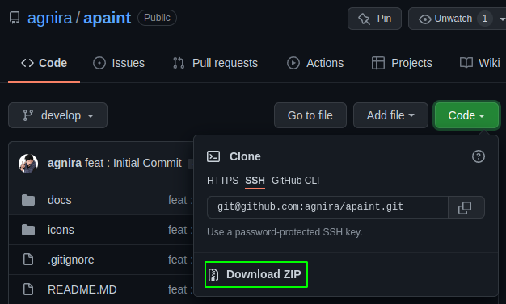
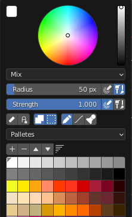

# Apaint

Apaint is my personal tool for speed up my texturing process on blender. With extending Blender Image Paint Context Menu, Apaint bring some shortcut to acces some menu that take your time when you do it over and over.

## How To download

## Addons Location

Righ Click on Image Paint mode.

## Features

1. Toggle Eraser
2. Alpha Lock
3. Occlude
4. Backface Culling
5. Draw Mode
6. Line Mode
7. Stamp Mode
8. Palette

> :information_source: **To Keep the UI clean, use your custom collor pallete**

## Upcoming Features

1. Brush List

> :warning: **If you found some bugs, or want to give feedback. You can write it on Issues Tab.**